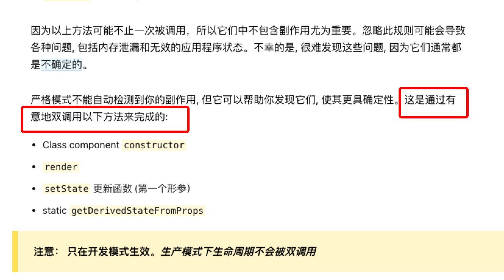

本页主要记录一些开发中遇到的问题和解决方法
=================

1.React.StrictMode模式下render里面setTimeout2次执行的问题（正常应该是1次）
-----------------
Q：在开发中发现，在render方法中使用setTimeout，定时器里面的方法会被执行2次，这个是和预期的不一样的。但是在ComponentDidMount中就是执行的1次。排除副作用的原因。考虑为什么会被执行两次？

A：经查，是在开发过程中引入的React.StrictMode导致的（[React.StrictMode](https://react.html.cn/docs/strict-mode.html)）,在开发模式下，React.StrictMode会主动的调用两次方法来完成监测。
```javascript
  class App extends React.Component {
    render() {
      setTimeout(() => {
        console.info("执行结果"); // 这里预期的情况下是打印1次，但是在开发模式下实际打印了2次
      }, 0);
      return null;
    }
  }
```
<!--  -->
  

---------
